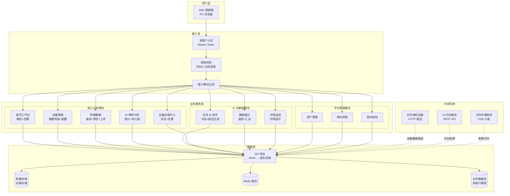
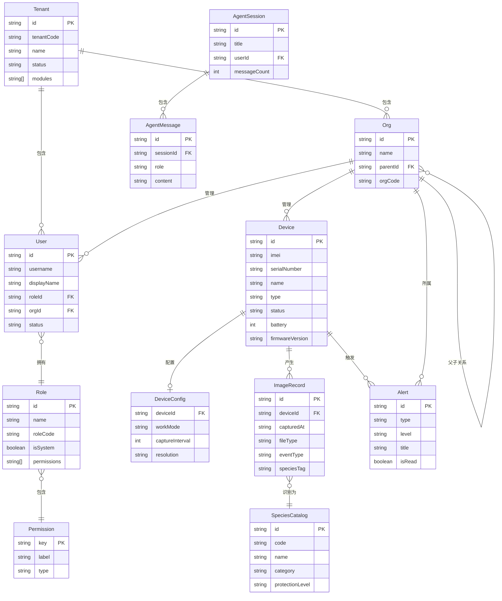
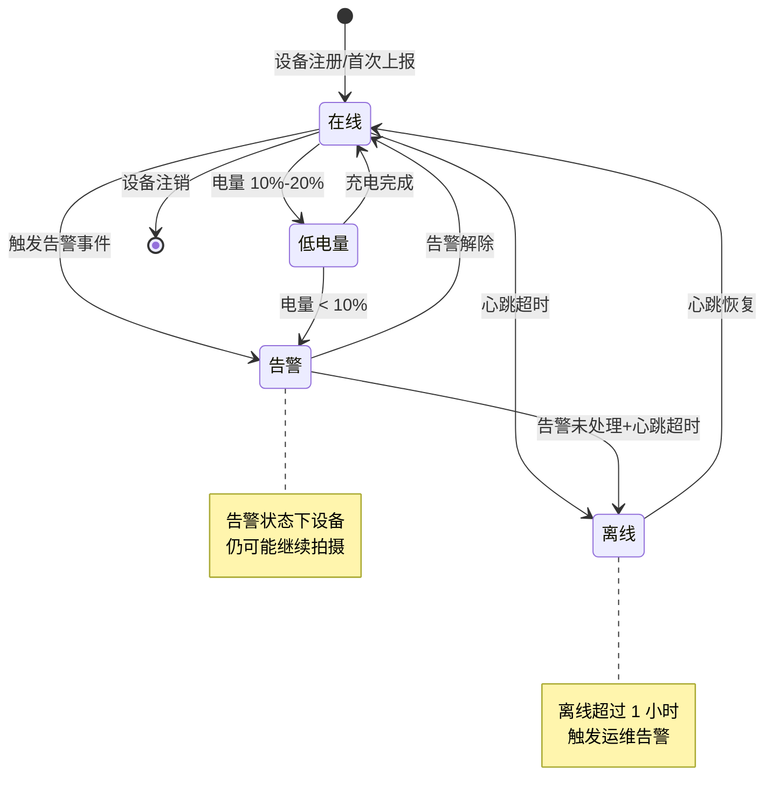
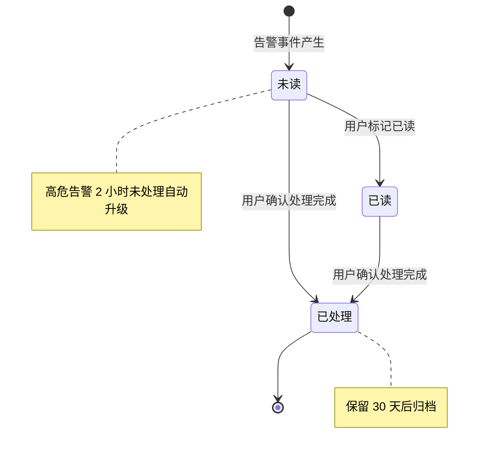
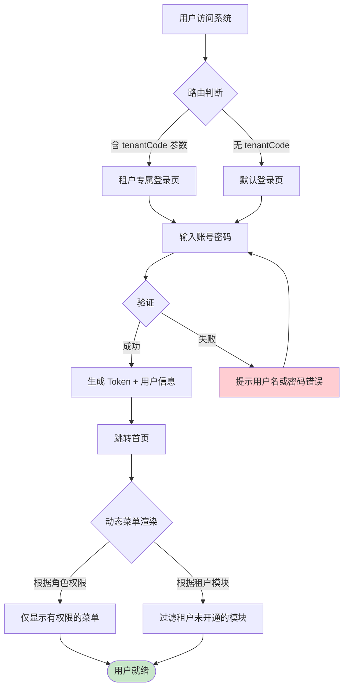

# AI 野生动物保护平台（野外守望者 2.0）PRD

| PRD 审核人 | 待填写 |
| --- | --- |
| 重要性 | 高 |
| 紧迫性 | 高 |
| 需求方 | 生态保护业务方 |
| PRD 编写人 | 产品团队 |
| PRD 提交日期 | 2026-08-05 |
| 产品类型 | 商业化 SaaS × 业务型管理软件 |

## PRD 修改记录

| 变更时间 | 变更内容 | 变更提出部门与理由 | 修改人 | 审核人 | 版本号 |
| --- | --- | --- | --- | --- | --- |
| 2026-08-05 | 初始版本 | 产品团队立项 | 产品团队 | 待填写 | v1.0 |

---

## 1、项目背景

### 1.1 业务现状

当前野生动物保护监测工作以红外相机为核心采集设备，已在全国多个自然保护区、湿地公园、森林监测站部署了大量监测终端。监测组织通常采用**总部—区域—监测站**三级管理架构，每个监测站部署数台至数十台红外相机。

**当前运行模式：**
- **设备管理**：各监测站手动记录设备台账，设备状态（在线/离线/电量）依赖定期巡检汇总，缺乏实时监控手段
- **影像数据**：相机自动触发 PIR 拍照/录像后存储于本地，人工定期导出到本地计算机，影像查看、筛选、统计流程繁琐
- **物种识别**：依赖人工逐帧查看影像进行物种识别和分类统计，耗时且准确率受经验影响大
- **告警处理**：设备离线、低电量、入侵等异常事件通过运维人员被动发现，缺乏主动告警和快速响应机制
- **AI 能力**：物种识别算法已具备基础能力，但缺乏面向监测场景的交互式 AI 助手，无法提供趋势分析、报告生成等高阶服务

### 1.2 面临问题

1. **设备管理分散，运维效率低**：各监测站设备状态不透明，离线/低电量设备平均发现延迟 > 48 小时，影响监测连续性
2. **影像数据孤岛，协同成本高**：影像数据分散在各监测站本地存储中，总部无法实时汇总查看，跨监测站的物种活动对比分析几乎不可行
3. **人工识别效率低，数据价值未释放**：一台相机日均产生 50-100 条抓拍记录，监测员平均每天需花费 2-3 小时进行人工识别
4. **告警响应滞后，风险敞口大**：入侵告警、盗猎行为等高危事件从发生到发现平均延迟 > 24 小时，错失最佳处置时机
5. **多组织协同缺失，权限管理混乱**：不同保护地/租户之间数据需要严格隔离，但现有模式下权限控制依赖人工约定，存在数据越权访问风险

### 1.3 解决思路

本项目构建一套**多租户 SaaS 化的野生动物生态监测管理平台**，以"设备—影像—物种—告警—AI 助手"为主线，打造从数据采集、智能识别到业务决策的一体化工作闭环：

- **设备层**：接入红外相机设备，实时监控设备在线状态、电量、固件版本，支持设备批量导入和远程配置
- **影像层**：统一汇聚各监测站影像数据，支持实时预览、历史查询、批量上传，内置 AI 物种自动识别
- **分析层**：提供物种统计、分布热力图、趋势分析等数据洞察能力
- **AI 助手层**：基于多源数据（物种知识库、历史监测数据、环境因子、设备运行数据）构建交互式 AI 助手，支持自然语言查询、自动报告生成
- **管理层**：提供组织架构管理、RBAC 权限体系、多租户隔离，支撑大规模跨组织协同

### 1.4 决策依据

- **政策驱动**：2021 年《"十四五"林业草原保护修复和高质量发展规划》明确提出推进野生动物监测体系数字化
- **技术成熟**：AI 物种识别模型准确率已达 90%+，红外相机设备成本下降，云端存储和计算能力充足
- **市场验证**：已有多个自然保护区表达了数字化升级意愿，预计首批可覆盖 50+ 监测站、500+ 设备
- **效率测算**：平台上线后，预计监测员日均有效工作时间节省 60%，设备故障平均发现时长缩短至 1 小时以内

---

## 2、需求基本情况

### 2.1 需求基础信息

| 要素 | 内容 |
| --- | --- |
| **需求提出人** | 生态保护业务方 / 产品负责人 |
| **功能使用人** | 监测员、组织负责人、超级管理员 |
| **受影响人** | 野外巡护员、科研人员、保护区管理层 |
| **场景描述** | 见下方核心场景 |
| **发生频率** | 日均使用，高峰期每日 50+ 活跃用户 |
| **核心痛点** | 解决野生动物监测行业中"数据分散、效率低下、协同困难"的核心痛点 |
| **需求价值** | 打造一站式生态监测工作台，提升监测效率 60%+，设备故障响应时效提升 90% |

### 2.2 核心场景描述

> 💡 场景六要素：人物、时间、地点、起因、经过、结果

**场景 1：监测员日常巡检**

- **人物**：张伟，华北区域监测站 A 普通监测员
- **时间**：每日上午 8:00
- **地点**：野外守望者 SaaS 平台 Web 端
- **起因**：张伟需要了解昨日监测站 A 各相机的拍摄情况和物种活动情况
- **经过**：登录系统 → 首页查看概览卡片和告警 → 进入影像模块查看各相机实时/历史影像 → 筛选出梅花鹿等重点物种的抓拍 → 使用 AI 助手询问"昨天监测站 A 梅花鹿活动情况" → 查看 AI 生成的统计和图表
- **结果**：在 15 分钟内完成过去需要 2 小时的巡检工作，高效掌握监测站动态

**场景 2：组织负责人月度汇报**

- **人物**：李四，华北区域组织负责人
- **时间**：每月 1 日
- **地点**：野外守望者 SaaS 平台 Web 端
- **起因**：需要向总部汇报上月监测情况
- **经过**：登录系统 → 使用 AI 助手"生成本月华北区域监测报告" → AI 自动汇总设备运行、物种监测、告警事件等数据 → 生成结构化报告 → 调整报告内容后导出
- **结果**：10 分钟内完成月度报告生成，数据准确、格式规范

**场景 3：告警应急处置**

- **人物**：监测员张伟
- **时间**：任意时刻（收到告警推送时）
- **地点**：野外守望者 SaaS 平台 Web 端
- **起因**：相机-003 产生入侵告警（检测到疑似人类活动）
- **经过**：收到告警通知 → 进入运维中心查看告警详情 → 定位到相机-003 所在监测站 A → 查看相机实时影像 → 确认是巡护人员还是可疑人员 → 决定是否上报上级
- **结果**：从告警发生到处置决策全流程 < 5 分钟，有效支撑应急响应

**场景 4：超级管理员权限配置**

- **人物**：平台管理员 admin
- **时间**：新用户入职或组织调整时
- **地点**：野外守望者 SaaS 平台 Web 端
- **起因**：新监测员入职，需要分配对应角色和权限
- **经过**：进入系统管理 → 用户管理 → 新增用户 → 分配"普通监测员"角色 → 绑定所属组织 → 用户登录后仅能查看权限范围内的功能和数据
- **结果**：完成用户账号开通，权限精确到页面元素级别，数据按组织隔离

---

## 3、商业分析

> 💡 本产品为商业化 SaaS 产品，以下分析采用 STP 市场细分 + 竞品分析框架

### 3.1 目标市场与客户分析

| 分析维度 | 内容 |
| --- | --- |
| **目标市场** | 中国自然保护区、国家公园、湿地公园、森林公园、野生动物监测机构 |
| **市场规模** | 国内各级自然保护区约 2800+ 个，监测设备市场规模约 50 亿元（含硬件+软件），软件平台 TAM 约 10 亿元 [TODO: 补充权威数据来源] |
| **市场特征** | 政策驱动型市场、客户预算有限但稳定、决策周期 3-6 个月、注重数据安全和定制化需求 |
| **发展趋势** | 智慧林业/智慧保护区建设加速、AI+IoT 在生态监测中渗透率提升、SaaS 化替代本地化部署 |
| **客户画像** | 主要客户：省级/市级自然保护区管理局、国家公园管理处；决策人：信息中心主任/生态监测科长；使用者：一线监测员、巡护员 |
| **客户痛点** | 设备管理分散、影像数据利用率低、物种统计依赖人工、跨部门协同困难、缺乏实时告警能力 |
| **卖点提炼** | "一站式 AI 生态监测工作台：设备-影像-物种-告警全链路打通，让监测效率提升 60%" |

### 3.2 竞品分析

| 分析维度 | 竞品 A：华为云智慧林业 | 竞品 B：某区域性监测平台 | 我方产品 |
| --- | --- | --- | --- |
| **商业模式** | 硬件+软件一体化方案，按项目制交付 | 私有化部署，按年续费 | SaaS 订阅模式，支持公有云/私有化部署 |
| **目标客户** | 大型国有林场、省级林业部门 | 地方性保护区、中小型监测站 | 全国各级保护区，专注生态监测场景 |
| **运营策略** | 项目制交付，靠硬件捆绑 | 区域深耕，定制化强 | SaaS 标准化+行业模板，轻量接入 |
| **市场份额** | 约 15%（硬件+整体方案） | 约 5%（区域性） | 新锐，聚焦细分生态监测场景 |
| **核心功能** | 视频监控、防火预警、GIS 地图 | 设备管理、简单数据展示 | 设备管理+AI 物种识别+AI 助手+多租户 |
| **核心价值** | 品牌强、方案全 | 本地化服务好 | AI 能力深度集成、多租户 SaaS 架构、场景化设计 |
| **优势** | 品牌知名度高、生态链完整 | 定制化灵活、响应快 | AI 助手交互、开箱即用、持续迭代 |
| **劣势** | 价格高、方案重、上线周期长 | 功能覆盖有限、AI 能力弱 | 品牌知名度待建立、生态链尚在建设 |

### 3.3 差异化定位

**"AI 原生的生态监测 SaaS 平台"**

与竞品相比，本产品的核心差异化在于：

1. **AI-Native 架构**：不是把 AI 作为附加功能，而是将 AI 物种识别、AI 趋势分析、AI 报告生成作为核心工作流的一部分，贯穿"查看—分析—决策"全链路
2. **多租户 SaaS 原生设计**：天然支持跨组织协同，数据隔离粒度精确到组织+个人，适合大型保护区集团化管控
3. **场景化交互**：围绕监测员日常工作流设计交互，首页即工作台，减少跳转，提升效率
4. **轻量化部署**：无需自建机房和服务器，开箱即用，首次部署 < 1 天

### 3.4 SaaS 商业模型预估

| 指标 | 预估值 | 说明 |
| --- | --- | --- |
| **目标定价** | 标准版 0.8 万/年/租户；专业版 2 万/年/租户；旗舰版 5 万/年/租户 | 按监测站规模和功能区分 |
| **CAC（获客成本）** | 预估 1.5 万元 | 含销售+市场费用 |
| **LTV（客户生命周期价值）** | 预估 7.2 万元 | = ARPU × 6 年客户生命周期 |
| **LTV/CAC** | 4.8 > 3 | 健康基线 |
| **目标 Churn Rate** | 月 < 2%（年 < 20%） | SaaS 行业健康水平 |
| **回本周期** | 约 9 个月 | CAC / 月 ARPU |

> 💡 SaaS 健康基线：LTV/CAC > 3，回本周期 < 12 个月

---

## 4、项目收益目标

### 4.1 项目目标

| 目标类型 | 目标描述 | 衡量指标 | 目标值 | 达成时限 |
| --- | --- | --- | --- | --- |
| **核心业务目标** | 打造国内领先的 AI 生态监测 SaaS 平台 | 首批付费客户数 | 5 家 | 上线后 6 个月 |
| **核心业务目标** | 覆盖监测设备规模 | 接入设备数 | 500 台 | 上线后 12 个月 |
| **效率目标** | 提升监测员日均有效工作时间 | 人均节省工时 | ≥ 60% | 上线后 3 个月 |
| **效率目标** | 缩短设备故障响应时效 | 从故障发生到发现的平均时长 | ≤ 1 小时 | 上线后 1 个月 |
| **体验目标** | AI 助手用户采纳率 | 周活跃用户占日活用户比例 | ≥ 40% | 上线后 3 个月 |
| **体验目标** | 客户满意度 | NPS 评分 | ≥ 50 | 上线后 6 个月 |
| **商业目标** | 平台营收 | 年化经常性收入 (ARR) | ≥ 50 万元 | 上线后 12 个月 |

### 4.2 验收标准

1. **功能完整性验收**：第 10 章功能清单中 P0 功能 100% 实现，P1 功能 ≥ 80% 实现
2. **性能验收**：首页首屏加载时间 < 2 秒，核心页面接口响应时间 < 1 秒
3. **安全验收**：多租户数据隔离验证通过，RBAC 权限精确到页面元素级别
4. **AI 能力验收**：物种识别准确率 ≥ 90%，AI 助手响应时间 < 3 秒
5. **兼容性验收**：Chrome/Edge 最新两个大版本完美适配

### 4.3 成功标准

> 项目上线后 6 个月内，达到以下指标视为成功：

1. 首批 5 家付费客户全部成功上线并持续使用
2. 日活跃用户数 ≥ 50 人（不含超级管理员）
3. AI 助手周均调用次数 ≥ 200 次
4. 客户续费率 ≥ 80%
5. NPS 满意度评分 ≥ 50

---

## 5、项目方案概述

### 5.1 核心功能概述

本项目包含以下核心功能模块：

| 序号 | 功能模块 | 功能简述 | 优先级 |
| --- | --- | --- | --- |
| 1 | 统一认证与权限 | 多租户登录、RBAC 权限体系、动态菜单渲染 | P0 |
| 2 | 首页工作台 | 概览统计卡片、近期告警、快捷入口 | P0 |
| 3 | 设备管理 | 设备增删改查、批量导入、远程配置、状态监控 | P0 |
| 4 | 影像数据 | 实时影像预览、历史影像查询、批量上传/下载、AI 标注 | P0 |
| 5 | 数据展示 | 设备运行概览、捕获趋势图表、每日汇总 | P0 |
| 6 | AI 物种分析 | 物种统计、分布热力图、物种目录、识别结果查看 | P0 |
| 7 | 生态 AI 助手 | 自然语言交互、自动报告生成、多源数据查询 | P0 |
| 8 | 设备运维中心 | 设备状态总览、告警管理、运维提示 | P0 |
| 9 | 环境监测 | 环境因子数据展示（温度、湿度、月相等） | P0 |
| 10 | 用户/角色/组织管理 | 用户管理、角色权限配置、组织架构管理 | P1 |
| 11 | 版本信息与通知 | 系统版本展示、通知告警中心 | P1 |

### 5.2 方案概述

- **产品方案**：多租户 SaaS 架构，按租户隔离数据和功能模块，支持标准版/专业版/旗舰版三种套餐
- **技术方案**：前端 React 18 + TypeScript + Ant Design + ECharts，后端待定（预留 RESTful API 接入层），采用 Mock 数据先行模式快速验证业务闭环
- **运营方案**：试点部署→种子客户验证→全量推广，配套培训和客户成功体系

### 5.3 MVP 范围

> 💡 B 端 MVP 原则：必须支撑核心业务流程闭环，不是"最简单的版本"

**MVP 包含的功能：**
1. 统一认证与多租户登录 — 支撑最基础的安全访问
2. 首页工作台 — 用户登录后第一眼看到核心数据
3. 设备管理（增删改查+状态监控）— 核心业务对象管理
4. 影像数据（查询+实时预览）— 核心业务数据查看
5. AI 物种分析（统计+热力图）— 核心 AI 能力验证
6. 生态 AI 助手（自然语言交互）— 差异化核心能力验证
7. 设备运维中心（告警管理）— 关键异常处理闭环
8. 用户/角色/组织管理 — 支撑最基础的权限治理

**MVP 暂不包含的功能：**
- 环境监测模块（依赖环境因子数据接入，延后接入）
- 影像批量上传/下载（优化体验后再开放）
- 物种目录管理（内部运营功能，延后开放给租户）
- 通知告警中心交互增强（P2 功能）

**核心验证假设：**
1. 假设 1：AI 助手的自然语言交互能显著提升用户获取信息的效率和满意度
2. 假设 2：多租户 SaaS 架构能满足不同规模保护地的数据隔离和功能定制需求
3. 假设 3：一站式工作台能有效降低监测员的工具切换成本，提升日均有效工作时间

---

## 6、项目范围

### 6.1 涉及系统

| 系统名称 | 关系类型 | 影响描述 | 责任方 |
| --- | --- | --- | --- |
| 野外守望者 SaaS 平台（本系统） | 主体 | 新建 | 产品团队 |
| 红外相机设备 | 数据来源 | 通过设备 HTTP 接口推送影像和状态数据 | 设备厂商 |
| 物种识别 AI 服务 | AI 能力提供者 | 调用 AI 模型 API 完成物种识别 | AI 团队 |
| 文件存储服务 | 数据存储方 | 存储影像文件，提供下载链接 | 运维团队 |
| 统一身份认证（可选） | 认证集成 | 对接企业 SSO（P1 阶段） | IT 团队 |

### 6.2 影响范围

- **用户影响**：监测员、组织负责人、超级管理员等全部内部使用角色
- **流程影响**：原有"手动记录设备台账+人工导出影像+逐帧识别"的工作流将被替换为线上一站式工作台
- **数据影响**：影像数据从本地存储迁移至云端存储，需制定数据迁移和备份策略
- **上下游影响**：需与设备厂商对接设备数据推送协议，需与 AI 团队对接识别模型 API

### 6.3 不在本期范围内

1. **移动端 App**：本期仅覆盖 Web 管理端，移动端纳入后续规划
2. **实时视频流解码和推流**：本期仅提供静态影像预览入口，不涉及实时视频流
3. **硬件设备固件远程升级**：本期仅展示固件版本信息，不实现远程升级能力
4. **私有化部署版本**：本期优先推进公有云 SaaS，私有化部署作为 P1 规划
5. **国际化支持**：本期仅支持中文，多语言纳入后续规划
6. **第三方系统集成**：本期不与 OA、ERP 等内部系统做深度集成，预留 API 接口

---

## 7、项目风险

### 7.1 前提假设

| 编号 | 假设内容 | 如果假设不成立的影响 |
| --- | --- | --- |
| A1 | 设备厂商能提供稳定的设备数据推送接口 | 无法获取设备实时状态和影像数据，需开发设备网关中间件 |
| A2 | AI 物种识别模型准确率 ≥ 90%，响应时间 < 2 秒 | 用户信任度下降，需人工复核机制作为降级方案 |
| A3 | 首批目标客户愿意采用 SaaS 模式而非私有化部署 | 商业模式需调整，需增加私有化部署版本 |
| A4 | 客户具备基础网络条件，设备可稳定联网 | 需提供离线缓存和数据补传机制 |

### 7.2 约束条件

| 编号 | 约束描述 | 对设计的影响 |
| --- | --- | --- |
| C1 | 影像文件体积大（单文件 2-20MB），需考虑存储和带宽成本 | 采用影像压缩、分级存储、CDN 加速策略 |
| C2 | 不同保护地网络环境差异大，可能存在内网部署需求 | 需设计轻量版本或考虑私有化部署选项 |
| C3 | 数据安全合规要求高（涉及野生动物保护敏感数据） | 需通过等保三级认证，数据加密传输和存储 |
| C4 | 客户预算有限，需控制产品定价 | MVP 聚焦核心功能，后续通过增值功能提升客单价 |

### 7.3 风险清单

| 编号 | 风险类别 | 风险描述 | 发生概率 | 影响程度 | 应对方案 |
| --- | --- | --- | --- | --- | --- |
| R1 | 产品风险 | 客户需求差异大，标准化 SaaS 难以覆盖所有场景 | 中 | 高 | 提供标准版/专业版/旗舰版套餐，预留行业模板机制 |
| R2 | 产品风险 | AI 助手回答不准确或超出预期，影响用户信任 | 中 | 高 | 设置置信度阈值，低置信度结果标注"仅供参考"，提供人工反馈入口 |
| R3 | 运营风险 | 客户迁移成本高，从旧工作流切换阻力大 | 高 | 中 | 提供数据迁移工具、培训手册、试点客户成功案例 |
| R4 | 运营风险 | 多租户数据隔离出现漏洞，导致数据越权访问 | 低 | 极高 | 采用 Schema 级隔离策略，定期安全审计，渗透测试 |
| R5 | 技术风险 | 影像文件存储和带宽成本超预期 | 中 | 中 | 采用分级存储策略（热/温/冷），影像自动压缩，CDN 分发 |
| R6 | 技术风险 | 设备离线率高，数据采集不完整 | 中 | 中 | 设备状态实时监控，离线告警自动推送，数据补传机制 |
| R7 | 合规风险 | 野生动物保护数据涉及敏感信息，存在合规风险 | 低 | 高 | 数据加密存储，操作审计日志，通过等保三级认证 |
| R8 | 市场风险 | 竞品抢先推出 AI 原生生态监测产品 | 中 | 中 | 快速迭代，聚焦 AI 助手差异化，建立先发优势 |

---

## 8、术语和缩略语

| 术语/缩略语 | 全称 | 定义说明 |
| --- | --- | --- |
| SaaS | Software as a Service | 软件即服务，用户通过浏览器即可使用的云端软件 |
| 租户 (Tenant) | — | 独立组织的访问与数据隔离单元，通过 tenantCode 标识 |
| RBAC | Role-Based Access Control | 基于角色的访问控制 |
| PIR | Passive Infrared | 被动红外传感器，红外相机核心触发技术 |
| IMEI | International Mobile Equipment Identity | 设备唯一识别码 |
| SN | Serial Number | 设备序列号 |
| NPS | Net Promoter Score | 净推荐值，衡量客户满意度的指标 |
| TAM/SAM/SOM | Total Addressable Market / Serviceable Addressable Market / Serviceable Obtainable Market | 总可寻址市场/可服务可寻址市场/可获取可服务市场 |
| CAC | Customer Acquisition Cost | 获客成本 |
| LTV | Customer Lifetime Value | 客户生命周期价值 |
| ARR | Annual Recurring Revenue | 年化经常性收入 |
| AI Agent | — | AI 智能体，可通过自然语言交互完成复杂任务的 AI 系统 |
| AI Native | — | AI 原生架构，指 AI 能力不是附加功能而是核心架构的一部分 |

---

## 9、参考文献和引用文档

| 文档名称 | 版本 | 链接/位置 | 说明 |
| --- | --- | --- | --- |
| 野外守望者 2.0 前端源码 | v1.0 | src/ | 项目前端代码，包含 Mock API 和完整业务逻辑 |
| 产品原型设计稿 | 待创建 | [TODO: 补充 Figma 设计稿链接] | 高保真设计稿 |
| AI 物种识别模型技术文档 | v3.2 | [TODO: 补充技术文档链接] | 识别模型的能力边界和接口规范 |
| 红外相机设备对接协议 | — | [TODO: 补充设备厂商接口文档] | 设备数据推送协议 |
| 《"十四五"林业草原保护修复规划》 | — | 公开政策文件 | 行业政策背景 |
| 《决胜B端》 | 第二版 | 参考方法论 | PRD 方法论参考 |
| 生态监测行业白皮书 2025 | — | [TODO: 补充白皮书链接] | 市场数据来源 |

---

## 10、功能需求

### 10.1 产品框架概述

#### 10.1.1 应用架构图

#### 10.1.2 数据模型图

**核心实体说明：**

| 实体 | 说明 | 关键业务规则 |
| --- | --- | --- |
| Tenant | 租户，多租户隔离核心 | 不同租户间数据严格隔离 |
| User | 用户，系统使用者 | 支持启用/禁用状态，禁用用户无法登录 |
| Role | 角色，权限集合 | 系统角色不可编辑和删除 |
| Device | 设备，红外相机 | 状态：在线/离线/告警/低电量 |
| ImageRecord | 影像记录 | 关联设备和 AI 识别结果 |
| Alert | 告警事件 | 支持已读/未读状态 |
| SpeciesCatalog | 物种目录 | 含保护级别信息（国家一/二级） |

#### 10.1.3 设备状态机

**设备状态转换表：**

| 当前状态 | 触发事件 | 目标状态 | 触发条件 | 操作角色 |
| --- | --- | --- | --- | --- |
| 初始 | 设备首次上报数据 | 在线 | 设备完成注册并成功上报 | 系统自动 |
| 在线 | 触发入侵/盗猎告警 | 告警 | AI 检测到可疑行为 | 系统自动 |
| 在线 | 心跳超时（>30 分钟） | 离线 | 设备无数据上报 | 系统自动 |
| 在线 | 电量降至 10%-20% | 低电量 | battery ∈ [10, 20] | 系统自动 |
| 告警 | 告警事件解除 | 在线 | AI 确认告警事件结束 | 系统自动 |
| 低电量 | 电量继续下降至 < 10% | 告警 | battery < 10 | 系统自动 |
| 任意状态 | 管理员注销设备 | [*] | 手动注销 | 管理员 |

#### 10.1.4 告警状态机

#### 10.1.5 功能清单

| 子系统 | 页面 | PC 端 | 说明 |
| --- | --- | --- | --- |
| 统一认证 | 登录页（默认） | ✓ | 超级管理员登录入口 |
| 统一认证 | 登录页（租户码） | ✓ | 租户专属登录页 |
| 首页工作台 | 首页 | ✓ | 概览卡片+告警列表 |
| 设备管理 | 设备列表 | ✓ | 分页、搜索、筛选 |
| 设备管理 | 设备详情/表单 | ✓ | 新增/编辑设备 |
| 设备管理 | 设备配置 | ✓ | 远程配置设备参数 |
| 设备管理 | 批量导入 | ✓ | 序列号批量导入 |
| 影像数据 | 实时影像 | ✓ | 在线设备实时预览 |
| 影像数据 | 影像查询 | ✓ | 多条件筛选查询 |
| 影像数据 | 影像详情 | ✓ | 单条影像查看/下载/标注 |
| 数据展示 | 数据概览 | ✓ | 核心指标卡片 |
| 数据展示 | 趋势图表 | ✓ | 捕获趋势/物种趋势 |
| 数据展示 | 每日汇总 | ✓ | 按日统计明细 |
| AI 物种分析 | 物种统计 | ✓ | 动物/植物分类统计 |
| AI 物种分析 | 分布热力图 | ✓ | 物种×监测站热力图 |
| AI 物种分析 | 物种图片 | ✓ | 识别结果图片浏览 |
| 生态 AI 助手 | 对话页面 | ✓ | 自然语言交互 |
| 生态 AI 助手 | 报告生成 | ✓ | 自动生成监测报告 |
| 设备运维 | 运维概览 | ✓ | 设备状态+告警统计 |
| 设备运维 | 告警列表 | ✓ | 全部告警事件管理 |
| 环境监测 | 环境数据 | ✓ | 温度/湿度/月相等 |
| 用户管理 | 用户列表 | ✓ | 增删改查用户 |
| 角色权限 | 角色列表 | ✓ | 角色定义+权限分配 |
| 组织架构 | 组织树 | ✓ | 组织管理+成员管理 |
| 系统管理 | 系统设置 | ✓ | 版本信息/密码修改 |

### 10.2 产品需求详解

#### 10.2.1 统一认证与权限模块

##### 10.2.1.1 业务流程图

##### 10.2.1.2 页面交互

**登录页**

**查询条件：**

| 字段名称 | 默认值 | 字段类型 | 备注 |
| --- | --- | --- | --- |
| 租户码 | 从 URL 参数解析 | 文本 | tenantCode 为 URL 路径参数 |
| 用户名 | — | 文本 | 支持中英文 |
| 密码 | — | 密码 | 不少于 6 位 |
| 记住我 | 勾选 | 复选框 | 记住用户名 7 天 |

**操作按钮：**

| 按钮名称 | 操作说明 | 触发条件 | 权限要求 |
| --- | --- | --- | --- |
| 登录 | 提交账号密码进行验证 | 填写用户名和密码 | 未登录用户 |

##### 10.2.1.3 业务规则

| 编号 | 规则类型 | 规则描述 |
| --- | --- | --- |
| R1 | 约束 | 用户名和密码均为必填项 |
| R2 | 约束 | 密码长度不少于 6 位 |
| R3 | 约束 | 租户码需匹配已注册租户，否则提示"租户不存在" |
| R4 | 触发条件 | 连续 5 次登录失败后，该账号锁定 30 分钟 |
| R5 | 计算 | Token 有效期为 24 小时，过期后需重新登录 |
| R6 | 推论 | 用户角色为"超级管理员"时，自动拥有 all 全部权限 |
| R7 | 事实 | 系统角色（isSystem=true）不可编辑和删除 |

#### 10.2.2 首页工作台模块

##### 10.2.2.1 页面交互

**首页工作台**

**概览卡片：**

| 卡片名称 | 数据来源 | 展示形式 | 备注 |
| --- | --- | --- | --- |
| 总设备 | deviceApi.batteryStats | 数字卡片 | 含总数 |
| 在线设备 | deviceApi.batteryStats | 数字卡片 | 绿色标识 |
| 离线设备 | deviceApi.batteryStats | 数字卡片 | 橙色标识 |
| 告警设备 | deviceApi.batteryStats | 数字卡片 | 红色标识 |
| 近期抓拍量 | dataApi.overview | 数字卡片 | 含环比趋势 |

**告警列表：**

| 字段名称 | 说明 | 展示形式 |
| --- | --- | --- |
| 告警类型 | 告警/警告/通知 | 标签（颜色区分） |
| 告警级别 | danger/warning/default | 图标+颜色 |
| 告警标题 | 如"相机-003 产生入侵报警" | 文本 |
| 告警时间 | 相对时间（2 分钟前） | 文本 |
| 已读状态 | 已读/未读 | 标记 |

##### 10.2.2.2 业务规则

| 编号 | 规则类型 | 规则描述 |
| --- | --- | --- |
| R1 | 触发条件 | 告警列表最多展示最近 5 条未读告警 |
| R2 | 约束 | 未读告警有高亮标记，已读告警视觉弱化 |
| R3 | 推论 | 点击告警条目直接跳转运维中心对应告警详情 |
| R4 | 计算 | 离线超过 1 小时的设备自动标记为"告警"状态 |

#### 10.2.3 设备管理模块

##### 10.2.3.1 页面交互

**设备列表页**

**查询条件：**

| 字段名称 | 默认值 | 字段类型 | 备注 |
| --- | --- | --- | --- |
| 关键字搜索 | — | 文本 | 搜索设备名称/IMEI/序列号 |
| 状态筛选 | 全部 | 下拉 | 在线/离线/告警/低电量 |
| 类型筛选 | 全部 | 下拉 | 500W/800W |
| 组织筛选 | 全部 | 组织树 | 按组织层级筛选 |

**列表字段：**

| 字段名称 | 字段类型 | 开放修改 | 备注 |
| --- | --- | --- | --- |
| 设备名称 | 文本 | 是 | 可点击进入详情 |
| IMEI | 文本 | 是 | 唯一标识 |
| 序列号 | 文本 | 是 | 序列号 |
| 设备类型 | 下拉 | 是 | 500W/800W |
| 所属组织 | 组织选择器 | 是 | 关联组织树 |
| 状态 | 标签 | 否 | 颜色区分 |
| 电量 | 进度条 | 否 | < 20% 红色警示 |
| 固件版本 | 文本 | 否 | 版本号展示 |

**操作按钮：**

| 按钮名称 | 操作说明 | 权限要求 |
| --- | --- | --- |
| 新增设备 | 打开新增表单 | devices:create |
| 编辑设备 | 打开编辑表单 | devices:update |
| 删除设备 | 弹出二次确认 | devices:delete |
| 设备配置 | 打开配置表单 | devices:config |
| 批量导入 | 粘贴序列号导入 | devices:create |

##### 10.2.3.2 业务规则

| 编号 | 规则类型 | 规则描述 |
| --- | --- | --- |
| R1 | 约束 | IMEI 和序列号全局唯一，不允许重复 |
| R2 | 约束 | 删除设备需二次确认，系统关键设备需超级管理员审批 |
| R3 | 约束 | 批量导入时，已存在的序列号自动跳过，不覆盖 |
| R4 | 触发条件 | 电量 < 20% 时，电量显示红色警示，自动触发低电量告警 |
| R5 | 触发条件 | 离线超过 1 小时的设备自动推送告警 |
| R6 | 约束 | 设备配置修改后立即生效 |
| R7 | 计算 | 在线率 = 在线设备数 / 总设备数 × 100% |

#### 10.2.4 影像数据模块

##### 10.2.4.1 页面交互

**影像查询页**

**查询条件：**

| 字段名称 | 默认值 | 字段类型 | 备注 |
| --- | --- | --- | --- |
| 设备选择 | 全部 | 下拉 | 支持多选 |
| 文件类型 | 全部 | 下拉 | 图片/视频 |
| 事件类型 | 全部 | 下拉 | PIR触发/定时/手动 |
| 智能分类 | 全部 | 下拉 | 动物/人/空拍 |
| 日期范围 | 近 7 天 | 日期范围 | 默认近 7 天 |
| 关键字 | — | 文本 | 搜索文件名/设备名/物种标签 |

##### 10.2.4.2 业务规则

| 编号 | 规则类型 | 规则描述 |
| --- | --- | --- |
| R1 | 约束 | 影像数据默认展示近 30 天记录 |
| R2 | 触发条件 | AI 自动识别完成后，在影像上显示物种标签和置信度 |
| R3 | 约束 | 置信度 < 80% 的识别结果标注"仅供参考" |
| R4 | 计算 | 空拍率 = 空拍记录数 / 总记录数 × 100% |
| R5 | 约束 | 支持批量下载，单批次最多 50 个文件 |

#### 10.2.5 AI 物种分析模块

##### 10.2.5.1 页面交互

**物种分析页**

| 区域 | 内容 | 展示形式 |
| --- | --- | --- |
| 分类选择 | 动物/植物 | 标签页切换 |
| 组织筛选 | 按组织过滤 | 下拉/组织树 |
| 物种统计 | 各物种抓拍数量+置信度 | 柱状图/饼图 |
| 分布热力图 | 物种×监测站交叉热力图 | 热力图（ECharts） |
| 物种明细 | 物种列表 | 表格 |
| 物种图片 | 物种识别结果图片 | 卡片网格 |

##### 10.2.5.2 业务规则

| 编号 | 规则类型 | 规则描述 |
| --- | --- | --- |
| R1 | 约束 | 物种分类分为"动物"和"植物"两个分类 |
| R2 | 计算 | 物种置信度 = AI 识别模型输出概率，取 Top-1 结果 |
| R3 | 触发条件 | 保护级别为"国家一级"的物种在热力图中高亮标记 |

#### 10.2.6 生态 AI 助手模块

##### 10.2.6.1 页面交互

**AI 助手对话页**

| 区域 | 内容 | 说明 |
| --- | --- | --- |
| 侧边栏 | 历史会话列表+数据源状态+快捷问题 | 可折叠 |
| 主区域 | 对话消息流 | 支持多种回复块 |
| 输入区 | 文本输入框+发送按钮+快捷问题 | Enter 发送 |

**AI 回复块类型：**

| 块类型 | 说明 | 示例场景 |
| --- | --- | --- |
| 文本块 | 自然语言说明 | 通用回复、分析结论 |
| 统计块 | 指标卡片（带趋势） | "本周告警 7 起，较上周下降 30%" |
| 表格块 | 结构化明细数据 | 物种分布明细、告警列表 |
| 图表块 | ECharts 可视化图表 | 趋势图、饼图、柱状图 |
| 报告块 | 结构化监测报告 | 月度/周报自动生成 |

##### 10.2.6.2 AI 功能设计

> 💡 确定性-容错性四象限分析

**任务特征分析：**

| 分析维度 | 评估 |
| --- | --- |
| 确定性 | 中（查询型任务，结果需基于数据但答案可能多样） |
| 容错性 | 高（分析建议类任务，允许一定误差） |
| 推荐交互模式 | Copilot 模式（AI 辅助填充+确认） |

**AI 交互设计：**

- **交互模式**：Copilot — AI 生成回复，用户确认/追问
- **人机边界**：
  - AI 执行：数据汇总、图表生成、报告草拟、统计计算
  - 人工审核：报告内容审核、异常事件判定
  - 人工决策：高风险操作审批
- **降级方案**：AI 服务不可用时，展示预置模板回复
- **监控指标**：问题解决率 ≥ 85%、首响应时间 < 3 秒

##### 10.2.6.3 业务规则

| 编号 | 规则类型 | 规则描述 |
| --- | --- | --- |
| R1 | 约束 | AI 回复必须附带数据引用来源 |
| R2 | 约束 | 置信度 < 80% 的分析结论标注"仅供参考" |
| R3 | 触发条件 | 输入含"报告/生成"时触发报告生成流程 |
| R4 | 触发条件 | 输入含"趋势/分析"时触发趋势分析流程 |
| R5 | 计算 | 报告自动包含：监测概况、物种监测、告警分析、环境因子、建议措施 |

#### 10.2.7 设备运维中心模块

##### 10.2.7.1 页面交互

**运维概览页**

| 区域 | 内容 | 展示形式 |
| --- | --- | --- |
| 设备状态卡片 | 在线/离线/告警/低电量设备数量 | 数字卡片+进度条 |
| 告警趋势 | 近 7 天告警趋势 | 折线图 |
| 告警类型分布 | 入侵/电量/离线告警占比 | 饼图 |
| 高危告警列表 | 未读高危告警 | 列表（红色高亮） |

**告警列表查询条件：**

| 字段名称 | 默认值 | 字段类型 |
| --- | --- | --- |
| 告警类型 | 全部 | 下拉 |
| 告警级别 | 全部 | 下拉 |
| 处理状态 | 全部 | 下拉 |
| 时间范围 | 近 7 天 | 日期范围 |

##### 10.2.7.2 业务规则

| 编号 | 规则类型 | 规则描述 |
| --- | --- | --- |
| R1 | 约束 | 高危告警（danger）在首页和运维中心均高亮展示 |
| R2 | 触发条件 | 高危告警产生后，系统自动推送通知给监测员 |
| R3 | 触发条件 | 高危告警 2 小时内未处理，自动升级通知上级 |
| R4 | 约束 | 已处理告警保留 30 天，之后自动归档 |

#### 10.2.8 用户/角色/组织管理模块

##### 10.2.8.1 页面交互

**用户列表页**

**查询条件：**

| 字段名称 | 默认值 | 字段类型 |
| --- | --- | --- |
| 关键字 | — | 文本 |
| 状态 | 全部 | 下拉 |
| 角色 | 全部 | 下拉 |
| 组织 | 全部 | 组织树 |

**操作按钮：**

| 按钮名称 | 操作说明 | 权限要求 |
| --- | --- | --- |
| 新增用户 | 打开新增表单 | users:create |
| 编辑用户 | 打开编辑表单 | users:update |
| 禁用/启用 | 切换用户状态 | users:update |
| 重置密码 | 设置新密码 | users:update |
| 删除用户 | 弹出二次确认 | users:delete |

**角色管理页**

| 操作按钮 | 操作说明 | 权限要求 |
| --- | --- | --- |
| 新增角色 | 打开角色定义表单 | roles:create |
| 编辑角色 | 修改角色名称/权限 | roles:update |
| 删除角色 | 弹出二次确认（系统角色不可删除） | roles:delete |

**组织管理页**

| 操作按钮 | 操作说明 | 权限要求 |
| --- | --- | --- |
| 新增组织 | 在选中节点下新增子组织 | orgs:create |
| 编辑组织 | 修改组织名称/编码 | orgs:update |
| 删除组织 | 弹出二次确认 | orgs:delete |
| 成员管理 | 查看/添加/移除成员 | orgs:view |
| 设备管理 | 查看组织下设备/批量移动 | orgs:view |

##### 10.2.8.2 业务规则

| 编号 | 规则类型 | 规则描述 |
| --- | --- | --- |
| R1 | 约束 | 系统角色（isSystem=true）不可编辑和删除 |
| R2 | 约束 | 用户名全局唯一，不允许重复 |
| R3 | 约束 | 禁用用户无法登录系统 |
| R4 | 触发条件 | 用户禁用后，其当前所有在线会话自动失效 |
| R5 | 约束 | 组织树支持无限层级，但建议不超过 5 级 |
| R6 | 约束 | 删除组织前必须先移除所有下属组织、成员和设备 |

### 10.3 异常情况处理方案

| 异常类型 | 异常场景 | 处理方案 |
| --- | --- | --- |
| 网络异常 | 提交操作时断网 | 本地暂存，恢复后自动重试/提示重新提交 |
| 并发冲突 | 多人同时编辑同一记录 | 乐观锁 + 冲突提示，后提交者需刷新确认 |
| 数据异常 | 外部系统返回错误数据 | 校验拦截 + 错误日志 + 人工处理入口 |
| 误操作 | 误删除重要数据 | 软删除 + 回收站 / 操作确认二次弹窗 |
| 业务异常 | 高危告警超时无人处理 | 超时提醒 → 升级提醒 → 自动转派上级 |
| AI 异常 | AI 服务不可用或响应超时 | 降级为模板回复 + 错误提示 + 告警通知管理员 |
| 设备异常 | 设备长时间离线 | 自动推送运维告警 + 短信/邮件通知责任人 |

---

## 11、数据埋点

### 11.1 埋点策略

- **埋点目标**：核心回答三个业务问题——（1）各功能模块的使用频率如何？（2）AI 助手的采纳率和满意度如何？（3）设备告警的响应时效如何？
- **埋点工具**：[TODO: 请确认公司统一的埋点工具，如 GrowingIO / 神策 / 自研]

### 11.2 页面埋点

| 页面名称 | 事件名称 | 事件类型 | 采集参数 | 用途说明 |
| --- | --- | --- | --- | --- |
| 登录页 | login_page_view | 页面曝光 | tenant_code, source | 监控登录页访问 |
| 首页工作台 | home_page_view | 页面曝光 | user_role, org_id | 监控首页使用率 |
| 设备列表 | device_list_view | 页面曝光 | user_role, org_id | 监控设备模块使用率 |
| 影像查询 | image_query_view | 页面曝光 | user_role, filter_conditions | 监控影像模块使用率 |
| AI 助手 | agent_page_view | 页面曝光 | user_role, session_id | 监控 AI 助手使用率 |
| 运维中心 | ops_page_view | 页面曝光 | user_role | 监控运维模块使用率 |
| 物种分析 | species_page_view | 页面曝光 | user_role, category | 监控物种分析使用率 |

### 11.3 行为埋点

| 操作名称 | 事件名称 | 触发条件 | 采集参数 | 用途说明 |
| --- | --- | --- | --- | --- |
| 登录成功 | login_success | 登录成功跳转 | user_role, tenant_code | 监控登录成功率 |
| 登录失败 | login_failed | 登录页报错 | error_code | 监控登录异常 |
| 设备新增 | device_create | 提交新增表单 | device_type, org_id | 监控设备管理活跃度 |
| 设备删除 | device_delete | 确认删除 | device_id, org_id | 监控高风险操作 |
| 影像下载 | image_download | 点击下载 | file_type, device_id | 监控影像使用频率 |
| AI 消息发送 | agent_message_send | 发送消息 | intent_type, message_length | 监控 AI 助手交互 |
| AI 报告生成 | agent_report_generate | 报告生成完成 | period, duration | 监控报告使用情况 |
| 告警标记已读 | alert_mark_read | 标记已读 | alert_type, alert_level | 监控告警处理效率 |
| 权限拒绝 | permission_denied | 访问无权限资源 | user_role, target_permission | 监控权限配置合理性 |

### 11.4 业务指标埋点

| 指标名称 | 计算方式 | 数据来源 | 统计周期 |
| --- | --- | --- | --- |
| 日活跃用户数 (DAU) | count(distinct user_id where login_success today) | 登录日志 | 日 |
| AI 助手采纳率 | count(agent_page_view users) / DAU | 页面埋点 | 日 |
| 告警响应时效 | avg(alert_handle_time - alert_create_time) | 告警日志 | 日 |
| 设备在线率 | count(status=online devices) / count(all devices) | 设备表 | 日 |
| AI 报告生成次数 | count(agent_report_generate) | 行为埋点 | 日 |
| 功能采纳率 | count(module_view users) / DAU | 页面埋点 | 日 |

---

## 12、角色和权限

### 12.1 角色定义

| 角色名称 | 角色说明 | 典型人群 | 数据范围 |
| --- | --- | --- | --- |
| 超级管理员 | 系统配置和全部权限 | 平台 IT 管理员 | 全部数据 |
| 普通监测员 | 查看业务数据、影像、AI 助手 | 一线监测员、巡护员 | 本组织及下属组织数据 |
| 组织负责人 | 管理本组织设备、成员、配置 | 保护区/区域负责人 | 本组织及下属组织数据 |
| 设备运维员 | 管理设备、处理告警 | 运维工程师 | 本组织设备数据 |

### 12.2 功能权限矩阵

| 序号 | 一级导航 | 页面 | 页面元素 | 超级管理员 | 普通监测员 | 组织负责人 | 设备运维员 |
| --- | --- | --- | --- | --- | --- | --- | --- |
| 1 | 首页 | 首页 | — | ✓ | ✓ | ✓ | ✓ |
| 2 | 首页 | 首页 | "查看全部告警"链接 | ✓ | — | ✓ | ✓ |
| 3 | 设备管理 | 设备列表 | — | ✓ | — | ✓ | ✓ |
| 4 | 设备管理 | 设备列表 | "新增设备"按钮 | ✓ | — | ✓ | ✓ |
| 5 | 设备管理 | 设备列表 | "编辑设备"按钮 | ✓ | — | ✓ | ✓ |
| 6 | 设备管理 | 设备列表 | "删除设备"按钮 | ✓ | — | — | — |
| 7 | 设备管理 | 设备列表 | "设备配置"按钮 | ✓ | — | ✓ | ✓ |
| 8 | 设备管理 | 设备列表 | "批量导入"按钮 | ✓ | — | ✓ | ✓ |
| 9 | 影像数据 | 影像查询 | — | ✓ | ✓ | ✓ | ✓ |
| 10 | 影像数据 | 影像详情 | "下载"按钮 | ✓ | ✓ | ✓ | ✓ |
| 11 | 影像数据 | 影像详情 | "标注"按钮 | ✓ | — | ✓ | — |
| 12 | 数据展示 | 数据概览 | — | ✓ | ✓ | ✓ | ✓ |
| 13 | AI 物种分析 | 物种统计 | — | ✓ | ✓ | ✓ | ✓ |
| 14 | AI 物种分析 | 物种图片 | — | ✓ | ✓ | ✓ | ✓ |
| 15 | 生态 AI 助手 | 对话页面 | — | ✓ | ✓ | ✓ | ✓ |
| 16 | 生态 AI 助手 | 对话页面 | "生成报告"按钮 | ✓ | — | ✓ | — |
| 17 | 设备运维 | 运维概览 | — | ✓ | — | ✓ | ✓ |
| 18 | 设备运维 | 告警列表 | — | ✓ | — | ✓ | ✓ |
| 19 | 设备运维 | 告警列表 | "标记已读"按钮 | ✓ | — | ✓ | ✓ |
| 20 | 环境监测 | 环境数据 | — | ✓ | ✓ | ✓ | ✓ |
| 21 | 用户管理 | 用户列表 | — | ✓ | — | — | — |
| 22 | 用户管理 | 用户列表 | "新增/编辑/删除" | ✓ | — | — | — |
| 23 | 角色权限 | 角色列表 | — | ✓ | — | — | — |
| 24 | 组织架构 | 组织树 | — | ✓ | — | ✓ | — |

### 12.3 数据权限设计

> 💡 数据权限 = 谁能看到/操作哪些数据范围

**数据权限策略：** 基于组织架构树的数据范围控制

| 角色 | 数据范围规则 | 说明 |
| --- | --- | --- |
| 超级管理员 | 全部数据 | 不受组织限制 |
| 组织负责人 | 本组织及下属组织数据 | 基于组织架构树，当前节点+所有子节点 |
| 普通监测员 | 本组织数据 | 仅所在组织的数据 |
| 设备运维员 | 本组织设备数据 | 仅所在组织的设备和告警数据 |

### 12.4 管理功能

- **用户管理**：创建/编辑/停用/启用用户账号、重置密码
- **角色管理**：创建/编辑/删除角色，配置权限集（系统角色不可编辑）
- **组织架构管理**：管理部门树结构，新增/编辑/删除组织节点，管理组织成员和设备
- **权限管理**：权限树定义了模块-操作两级权限，支持 `all` 通配符和父级继承

---

## 13、运营计划

### 13.1 上线发布计划

| 阶段 | 时间 | 范围 | 目标 | 回滚方案 |
| --- | --- | --- | --- | --- |
| 内测 | 2026-11 | 内部团队 | 基础功能验证、AI 助手效果验证 | 回退到 Mock 版本 |
| 种子客户 | 2026-12 | 3 家种子客户（清溪湿地、华北保护区、华南保护区） | 核心流程验证、客户反馈收集 | 按客户独立回滚 |
| 公测/灰度 | 2027-01 | 10 家目标客户 | 性能和体验验证、商业化模型验证 | 灰度关闭租户 |
| 正式发布 | 2027-02 | 全量开放 | 正式对外发布 | — |

### 13.2 种子客户策略

- **目标种子客户画像**：省级自然保护区/湿地公园，设备规模 50-200 台，有明确数字化升级意愿
- **种子客户数量**：3 家
- **合作方式**：免费试用 3 个月 + 联合开发（客户提供需求反馈，我方提供定制化优化）
- **核心验证点**：
  1. AI 助手交互是否能有效提升监测效率
  2. 多租户架构是否满足数据隔离需求
  3. 设备接入和影像上传流程是否顺畅
  4. 定价模型是否被客户接受

### 13.3 客户成功体系

- **Onboarding 流程**：租户开通 → 管理员培训 → 数据接入 → 用户培训 → 试运行 → 正式上线，全流程约 2 周
- **客服支持**：工作时间 9:00-18:00 在线客服响应，P0 问题 2 小时响应 SLA
- **续费策略**：到期前 30 天发起续费提醒，提供提前续费折扣（9 折）

### 13.4 培训计划

| 培训对象 | 培训内容 | 培训方式 | 培训时间 |
| --- | --- | --- | --- |
| 管理层 | 系统价值和数据看板 | 专场线上培训（1 小时） | 上线前 1 周 |
| 业务骨干 | 全功能操作培训 | 线上培训+操作手册（2 小时） | 上线前 3 天 |
| 普通用户 | 日常操作培训 | 视频教程+在线帮助（自学） | 上线后 |
| 运维人员 | 设备接入和故障排查 | 专项培训（4 小时） | 上线前 1 周 |

### 13.5 推广计划

| 渠道 | 方式 | 目标 | 预算 |
| --- | --- | --- | --- |
| 内容营销 | 行业白皮书、案例分享、公众号 | 建立品牌认知 | 2 万 |
| 会议营销 | 生态保护行业峰会、智慧林业论坛 | 获取目标客户线索 | 5 万 |
| 销售团队 | 直销+渠道分销 | 转化付费客户 | 按业绩提成 |
| 合作伙伴 | 与设备厂商联合推广 | 拓展客户覆盖 | 按分成 |

---

## 14、待决事项

| 编号 | 待决事项 | 涉及章节 | 负责人 | 预计决策时间 | 当前状态 |
| --- | --- | --- | --- | --- | --- |
| TBD-1 | 后端技术栈选型和团队组建 | 5、6 | [TODO] | 2026-09 | 待讨论 |
| TBD-2 | AI 物种识别模型的接入方案 | 10.2.6 | [TODO] | 2026-09 | 待讨论 |
| TBD-3 | 私有化部署是否纳入首期规划 | 3、5 | [TODO] | 2026-08 | 待讨论 |
| TBD-4 | 移动端的规划时间和范围 | 6 | [TODO] | 2026-10 | 待讨论 |
| TBD-5 | 数据埋点工具的选型 | 11 | [TODO] | 2026-10 | 待讨论 |
| TBD-6 | 等保三级认证的时间和预算 | 7 | [TODO] | 2026-11 | 待讨论 |
| TBD-7 | 设备厂商对接协议的确认 | 10.1.1 | [TODO] | 2026-09 | 待讨论 |
| TBD-8 | 首批种子客户的选定 | 13 | [TODO] | 2026-10 | 待讨论 |
| TBD-9 | 定价策略的最终确认 | 3.4 | [TODO] | 2026-09 | 待讨论 |
| TBD-10 | 物种目录是否开放租户自定义 | 10.2.5 | [TODO] | 2026-10 | 待讨论 |

> ⚠️ 待决事项 10 项，均为需进一步决策的事项，建议在 MVP 开发前优先确定 TBD-1、TBD-2、TBD-3、TBD-9。

---

## 附：待完善清单

### 信息待补充项

| 编号 | 待补充内容 | 涉及章节 | 补充方式 |
| --- | --- | --- | --- |
| 1 | 市场规模权威数据来源 | 3.1 | 参考易观、艾瑞、IDC 等第三方报告 |
| 2 | Figma 高保真设计稿 | 9 | 设计团队产出 |
| 3 | AI 识别模型技术文档 | 9 | AI 团队提供 |
| 4 | 设备厂商接口文档 | 9 | 设备厂商提供 |
| 5 | 生态监测行业白皮书 | 9 | 市场团队收集 |
| 6 | 移动端规划决策 | 6 | 管理层决策 |
| 7 | 私有化部署需求评估 | 3、6 | 销售团队收集客户反馈 |
| 8 | 数据埋点工具选型 | 11 | 技术团队评估 |

### 下一步行动

1. **2026-08 内**：完成产品评审，确认待决事项中的核心决策（TBD-1、TBD-3、TBD-9）
2. **2026-09 内**：启动后端开发，确认 AI 模型接入方案，锁定首批种子客户
3. **2026-10 内**：完成高保真设计稿，启动内测，确定种子客户名单
4. **2026-11 内**：完成内测，启动种子客户试点
5. **2026-12 内**：完成首批种子客户上线验证

---

## 自检清单

> 💡 PRD 质量自检，确认以下项目均已覆盖

- [x] 第 1 章：项目背景有具体的业务场景和数据支撑
- [x] 第 2 章：三类角色（提出人/使用人/受影响人）和场景六要素完整覆盖
- [x] 第 3 章：商业化 SaaS 产品具备市场分析、竞品分析、盈利模式
- [x] 第 4 章：项目目标包含北极星指标和量化验收标准
- [x] 第 5 章：有清晰的 MVP 范围和核心验证假设
- [x] 第 6 章：明确了涉及系统、影响范围和排除项
- [x] 第 7 章：覆盖了前提假设、约束条件和风险应对
- [x] 第 10 章：包含架构图、ER 模型、状态机、逐模块需求详解
- [x] 第 11 章：数据埋点覆盖页面、行为、业务指标三个维度
- [x] 第 12 章：RBAC 权限矩阵覆盖功能权限和数据权限
- [x] 第 13 章：运营计划包含上线发布、客户成功、培训、推广
- [x] 第 14 章：待决事项有明确负责人和决策时间

> ⚠️ 本文档基于前端代码分析生成，待后端接口定义和 AI 模型方案确定后，需同步更新相关章节。